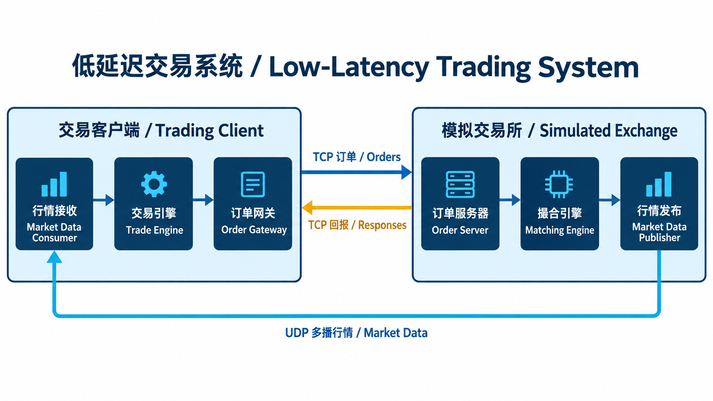
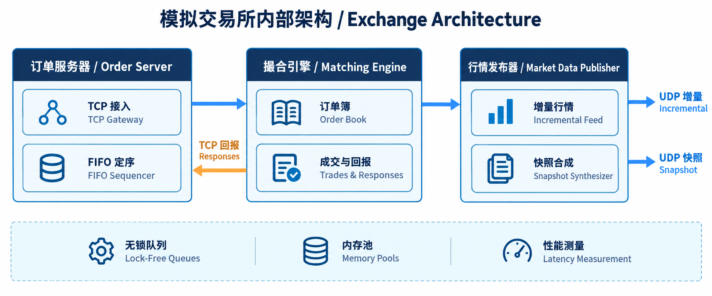
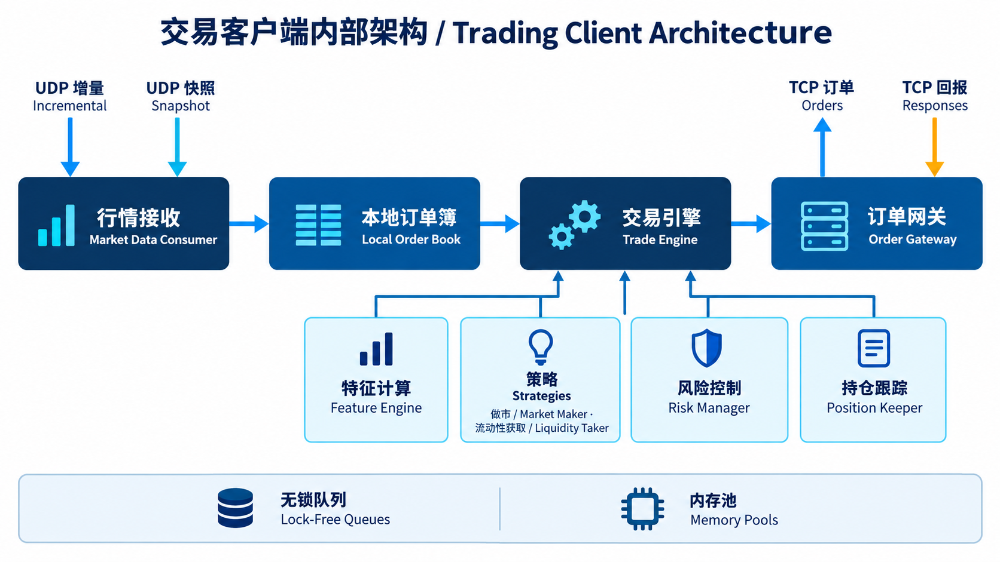

# TradeSystem｜低延迟交易系统学习项目

本项目基于 Packt《[Building Low Latency Applications with C++](https://github.com/PacktPublishing/Building-Low-Latency-Applications-with-CPP)》进行学习与二次开发。当前版本提供清洁基线：保留源码、构建脚本和清除运行输出的分析 notebook；移除了构建产物、日志及 HTML 报告。原项目采用 [MIT License](LICENSE)，版权声明保留在仓库中。

这是运行于 Linux 的**模拟交易所与交易客户端**，用于学习交易系统架构、C++ 并发与性能工程；不连接真实交易所，也不代表可用于实盘交易。后续改进将通过独立提交记录和测试结果说明。

## 系统架构 / Architecture



**订单链路 / Order path：** 客户端交易引擎产生请求，经订单网关通过 TCP 发送到交易所订单服务器；请求经 FIFO 定序后进入撮合引擎，订单响应再经 TCP 返回客户端。

**行情链路 / Market-data path：** 撮合引擎产生市场更新；行情发布器通过 UDP 多播发送增量行情，并由快照合成器发布订单簿快照。客户端行情接收器在正常状态消费增量数据，在序号出现缺口时利用快照恢复同步。

### 模拟交易所 / Exchange



- **订单服务器 / Order Server：** 基于 TCP 与 `epoll` 处理连接和订单，FIFO 定序器把请求交给撮合引擎。
- **撮合引擎 / Matching Engine：** 按订单簿状态处理新增、撤单与撮合，生成客户端回报和市场更新。
- **行情发布 / Market Data Publisher：** 发布增量消息，快照合成器维护并发布周期性快照。

### 交易客户端 / Trading Client



- **行情接收 / Market Data Consumer：** 接收增量与快照多播消息，处理序号缺口与快照同步。
- **交易引擎 / Trade Engine：** 更新本地订单簿，组织特征计算、策略、风险检查、订单管理和持仓跟踪。
- **订单网关 / Order Gateway：** 通过 TCP 发送订单并接收回报；示例策略包括做市、流动性获取和随机订单生成。

## 技术栈 / Tech Stack

| 领域 | 本项目中的实现 |
| --- | --- |
| 语言与构建 | C++20、GCC、CMake；Linux 环境，使用 `pthread` |
| 网络编程 | TCP 订单通道、`epoll` 事件循环、UDP 多播增量行情与快照 |
| 并发通信 | 多线程组件、基于原子操作的预分配环形队列、CPU 亲和性设置 |
| 数据结构 | 交易所订单簿与客户端本地订单簿、价格档位和订单索引、对象内存池 |
| 交易逻辑 | FIFO 请求定序、撮合、订单管理、风险检查、持仓跟踪、做市与流动性获取示例 |
| 性能分析 | 时间戳埋点、日志与队列/内存池/哈希等基准程序；性能结论需以可复现实测为准 |

## 目录 / Repository Layout

```text
common/       线程、网络、队列、内存池、日志和性能工具
exchange/     订单服务器、撮合引擎、行情发布与快照合成
trading/      行情接收、订单网关、交易引擎和示例策略
benchmarks/   微基准程序
notebooks/    已清除运行输出的性能分析 notebook
scripts/      构建与示例运行脚本
assets/       重新绘制的架构图
```

## 构建与运行 / Build & Run

建议在 Linux 上安装 GCC、CMake 和 Ninja。项目的网络地址与接口目前在 `exchange/exchange_main.cpp` 和 `trading/trading_main.cpp` 中设为本机回环接口 `lo`；跨机器运行前需要调整它们。

```bash
cmake -S . -B cmake-build-release -G Ninja -DCMAKE_BUILD_TYPE=Release
cmake --build cmake-build-release -j 4

# 终端 1：启动模拟交易所
./cmake-build-release/exchange_main

# 终端 2：启动随机订单客户端
./cmake-build-release/trading_main 5 RANDOM
```

项目也提供 `scripts/` 下的示例脚本。运行过程中产生的 `*.log`、构建目录和 HTML 分析报告不会提交到 Git。

## 来源与后续开发 / Attribution & Roadmap

本项目基于 Packt Publishing 的《[Building Low Latency Applications with C++](https://github.com/PacktPublishing/Building-Low-Latency-Applications-with-CPP)》，遵循仓库中的 [MIT License](LICENSE)。架构图与本 README 为此仓库重新制作；基线代码本身不宣称为原创。

计划在该基线上逐步实现并验证队列正确性、订单簿数据结构与性能测量改进。每项改动应附带正确性测试、可复现的压测方法以及吞吐量和延迟分布，而不是仅给出未经说明的单一延迟数字。
