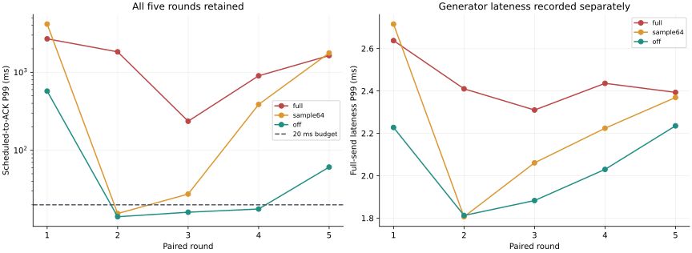
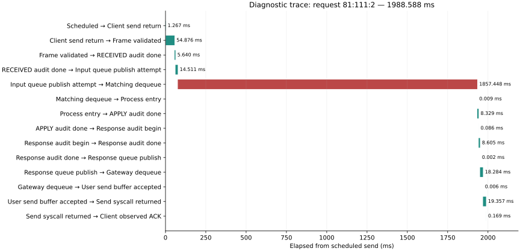
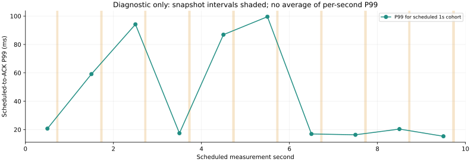

# 03 性能调优：吞吐、尾延迟与毛刺定位

补充说明（2026-10-03）：本报告新增[逐项源码修改前后对照](#source-comparison)，原失败记录、测试结果和性能数字保持原样。

验证日期：2026-10-03。项目：TradeSystem。基线版本：`3ac3c20e4171dccd0802294fea30179688d53da3`。

本次先保存改动前基准，再对一个性能日志候选改动重复测量，同时用独立实验检查队列、撮合簿、快照和 TCP 背压。代码保留在 VM 工作区，本文与测量证据单独提交；因此 GitHub 上的基线代码并未自动切换为候选模式。

实测结果是：关闭可选性能日志有明显收益，五轮配对 P99 降幅中位数为 96.28%；业务对账通过，但两轮仍未满足 20 ms 门槛，不能宣称尾延迟问题全部解决。快照公开返回类型的编译问题已修复并回归。

## 1. 测试时发现了什么问题

### 1.1 功能对账通过，但尾延迟不达标

改动前先做 2 秒真实 TCP 烟测，再执行 30 秒相同速率预热与 60 秒测量。测量窗口提供 100 请求/秒，4 个客户端、8 个品种，共 6,000 条测量请求。业务是非成交 NEW 与其对应的成功 CANCEL 各占一半；这张表统计的是网关确认回报，不能解释成成交延迟或成交笔数。

这次单独的改动前基准中，6,000 条请求最终均有对应回报，审计对账与最终空簿检查通过。计划发送到回报的 P99 为 **796.713 ms**，测量窗口内完成速率为 **99.983 请求/秒**。网关在预热加测量期间写了 **171,318,434 字节**日志。这一轮只能说明问题存在，后面的收益判断使用五轮交替对照，不能拿它和最快的候选轮次直接计算收益。

### 1.2 性能记录在空转循环里仍不断产生

`OrderServer::recvFinishedCallback()` 每次执行都调用性能计时宏，即使 FIFO 没有待发布请求。底层 `TCPServer::sendAndRecv()` 在忙轮询中继续调用这个回调，性能宏便反复读取计时点、格式化字符串、推入诊断日志队列。后台 logger 再把这些记录写入文件。

这些记录属于诊断信息。订单关键审计则由 `CriticalJournal` 独立完成，每个正常请求经过 `RECEIVED`、`APPLY`、`RESPONSE`，各次写入都执行 `fsync`。减少诊断信息和减少关键审计是不同的改动；本次没有取消、抽样或合并关键审计。

### 1.3 快照的公开接口无法从独立编译单元调用

新增快照规模实验初次编译失败：`SnapshotSynthesizer::addToSnapshot()` 和 `publishSnapshot()` 的头文件只写了待推导的 `auto` 返回类型。调用方看不到 `.cpp` 里的定义，因此编译器报“use before deduction of auto”。已有程序能构建，不代表这两个公开方法已经具备完整的跨文件调用声明。

首次失败日志保留，后文区分临时实验绕过和真正的接口修复。

## 2. 怎样寻找原因

### 2.1 先固定测量边界与验收门槛

正式比较的预先登记协议见 [experiment_plan.json](evidence/experiment_plan.json)。所有三种模式使用同一请求输入与种子，Release 构建、不启用 sanitizer；交易所限定在 VM 的 CPU 0–3，生成器在 CPU 4，网络为 `lo`，审计与诊断文件均放在 ext4。每次进程独立启动、预热 30 秒、测量 60 秒，窗口结束后允许排空。

环境为 Ubuntu 26.04 LTS、内核 7.0.0-34-generic、GCC 15.2.0、CMake 4.2.3、Python 3.14.4；VM 提供 8 个 vCPU、单 NUMA 节点。编译为 `-O3 -DNDEBUG -std=gnu++20`，配合 `-Wall -Wextra -Werror -Wpedantic`。CPU 亲和只限制允许使用的 vCPU 集合，没有把每个业务线程固定到专用物理核心。

每种模式运行五轮，轮间轮换顺序，基线可执行文件从干净版本冻结。候选源码没有提交，使用基线 commit、源码差异摘要、文件摘要、编译命令与可执行文件 SHA-256 标识它，不能虚构一个候选 commit。

事先门槛为：每一轮正确性通过；计划发送到回报的 P99 不超过 20 ms；至少 98% 的测量请求在 60 秒窗口内完成。最终收到所有回报与在窗口内及时收到回报分别计数。

分位数采用最近秩算法。表格给出每轮 P99 的中位数和范围；不把不同轮的 P99 平均或相加，不过滤慢轮次。生成器的计划时刻、首次写入、完整帧被内核接受、回报被观察到四类时间均保留，发送迟到独立报告。

### 2.2 将正式性能轮与带观测的诊断轮分开

正式轮不启用请求阶段采集和系统调用追踪。另建短诊断轮，为同一请求记录完整帧验证后、接收审计完成、FIFO 发布尝试、撮合取到请求、处理入口、APPLY 审计完成、回报审计前后、回报入队、网关取回报、用户态发送缓冲接纳和内核发送接纳等时刻。

阶段记录使用同一 VM 的 `CLOCK_MONOTONIC`，并检查 C++ `steady_clock` 与 Python `perf_counter` 的时钟契约。每个线程使用预分配事件空间，线程退出后导出 CSV；容量溢出单独计数。它是诊断构建，并非零开销：空采集开销和开关对照也单独保留。

阶段记录把 `client/ticker/order/kind` 作为本轮关联键。本负载不复用订单 ID、固定 session；它并不是通用的跨会话成交追踪器。发送完成点表示所有字节被本机内核接纳，不表示对端已收到。

另用 CPU 5 上的观察线程采集 `/proc` 线程状态、上下文切换、页错误、调度计数与目标 TCP 连接。`strace` 只跟踪这次启动的测试进程的 `fsync`，避免追踪空转网络调用造成更多干扰。所有带观测轮次只用于归因，不混入正式 P99。

### 2.3 不把无法取得的证据补成结论

`perf stat` 在当前 VM 上被权限策略拒绝，错误输出保留。因此本文没有给出 PMU cache-miss、instructions/cycle 或 CPU 火焰图结论，也没有修改 `perf_event_paranoid`、IRQ、NUMA 或其他全局内核策略。普通用户的 perf 访问受权限与能力控制，见 [Linux perf 安全文档](https://www.kernel.org/doc/html/latest/admin-guide/perf-security.html)。

`fsync` 的时长包括调用期间的等待，不能把整段时间等同于设备硬件服务时间；相关语义见 [Linux fsync 手册](https://man7.org/linux/man-pages/man2/fsync.2.html)。VM 的宿主机后台负载不可见，本文只对这次 VM 与输入范围负责。

## 3. 怎样处理问题

### 3.1 单项候选改动：可选的性能日志策略

为性能计时宏增加编译配置 `TRADE_PERF_TRACE_EVERY`：

| 配置 | 行为 | 信息代价 |
|---|---|---|
| `1` | 保留原来的全量诊断性能记录，也是默认值 | 日志与格式化开销最高 |
| `64` | 每个线程、每个调用位置每 64 次输出一次 | 缺少未抽中调用的诊断记录 |
| `0` | 关闭这些性能记录，连 logger 参数与计时点都不求值 | 无法从这些宏恢复阶段细节 |

普通业务日志、错误日志和关键审计保持原有语义。抽样是确定性的调用次数抽样，不能直接拿抽样日志计算全体订单 P99；全体请求的端到端数据仍由外部生成器记录。

专项两线程检查分别验证全量、抽样和关闭模式的输出条数与 logger 求值次数。关闭模式输出与求值次数均为 0；抽样计数不在不同线程间共享。

### 3.2 快照接口问题单独处理

初始组件实验通过把实现放入同一编译单元进行临时诊断，这只是一种测试绕过。随后将这两个公开方法明确声明为 `void` 返回，令头文件本身提供完整调用契约，再移除临时包含实现的方式，使用正常静态库链接重新编译、测试。

这一修复改变接口声明的可调用性，没有更换快照算法、包格式或审计策略，不声称获得运行时性能收益。它与前述日志策略的性能对照分开登记。

## 4. 重新测量与回归结果

### 4.1 五轮正式对照：收益存在，稳定验收尚未通过

下表单位为 ms，均为**每轮分位数的中位数**。每种模式五轮，每轮 6,000 条测量请求；完整数据见 [paired_summary.json](evidence/paired_summary.json) 和 [paired_runs.json](evidence/paired_runs.json)。

| 模式 | P50 | P95 | P99 | 五轮 P99 范围 | 各轮最大值的中位数 |
|---|---:|---:|---:|---:|---:|
| 原版全量性能日志 | 21.007 | 1,509.809 | 1,638.357 | 235.897–2,686.475 | 1,708.692 |
| 1/64 抽样 | 9.368 | 26.693 | 387.280 | 15.459–4,149.268 | 680.089 |
| 关闭性能日志 | 9.092 | 11.504 | 17.669 | 14.067–574.016 | 76.916 |



将同一轮的基线与候选配对，分别计算 `(基线 P99 − 候选 P99) / 基线 P99`：关闭模式的五个降幅为 **78.63%、99.23%、93.19%、98.04%、96.28%**，降幅中位数为 **96.28%**。这与“先对五轮 P99 取中位数，再计算其比例”的 **98.92%** 是不同的统计量，不能混称同一收益。

抽样模式的配对降幅中位数为 **57.07%**，但两轮反而变慢，五轮范围为 **−54.45% 到 99.15%**。不能把抽样当成稳定改善尾延迟的方案。

关闭模式三轮达到 20 ms P99 门槛，两轮没有达到，分别为 **574.016 ms** 与 **60.925 ms**。因此三种模式都没有达到“所有五轮均通过”的验收规则；本次保留全量默认值，只把关闭模式保留为待进一步验证的性能候选。

### 4.2 改善的代价与正确性

三种模式的日志总量中位数分别为 **170.748 MiB、21.558 MiB、14.922 MiB**，包括 30 秒预热和 60 秒测量。关闭模式较基线减少约 **91.26%**；剩余普通业务与错误日志仍然写出，关键审计仍然完整。

进程所有线程的粗采样 CPU 占用中位数分别为 **300.05%、338.29%、342.69%**。多线程进程可以超过 100%；关闭诊断记录后忙轮询消耗的 CPU 反而增加了约 **42.64 个百分点**，不能把这项修改同时说成 CPU 节省。该测量由 `/proc` ticks 与其实际采样区间计算，包含测量开始前的短等候和排空。

正式五轮对照共 **90,000 条测量请求**，加上每轮 3,000 条预热请求，审计共核对 **135,000 条请求**。每条正常请求对应 RECEIVED、APPLY 和 RESPONSE 三个审计阶段。所有 15 轮业务对账通过，测量请求超时和未发送均为 0，诊断日志丢弃均为 0，最终订单簿为空，三个队列均为 0，进程正常退出。

业务闭环通过不等于性能门槛通过。窗口内完成速率的最低一轮分别为 **99.333、96.683、98.933 请求/秒**，观察到窗口之后的回报仍保留在相应发起请求的延迟分布里。

### 4.3 队列容量：少一些重试，也可能多一些等待

两线程 SPSC 组件传递 100,000 条有序消息，生产者 CPU 0、消费者 CPU 1。消费者每 10,000 条暂停 10 ms，共注入 100 ms 停顿；这是刻意构造的组件背压实验，不能当持续业务容量。

| 容量 | 消息槽内存 | 队列停留 P50 | 队列停留 P99 | 满队列尝试次数中位数 |
|---|---:|---:|---:|---:|
| 128 | 3 KiB | 0.607 µs | 10.198 ms | 1,105,471 |
| 1,024 | 24 KiB | 0.950 µs | 11.086 ms | 1,044,235 |
| 8,192 | 192 KiB | 10.924 ms | 12.582 ms | 962,960 |

所有轮次无丢失、重复或乱序，最终队列为空。容量变大后重试次数有所下降，但更多消息积压在队列，等待 P50/P99 变差。所以本次没有放大交易系统默认队列。

生产者等待 P99 仅约 0.061 µs，却仍有约 10–11 ms 的最大等待：严重阻塞影响的消息比例很低，P99 本身不会展示全部极端事件。满队列尝试次数是重复尝试次数，不能解释成同样数量的丢单。

### 4.4 撮合簿：按业务类型比较，先保证输出一致

两套现有簿实现使用相同输入，比较全部订单回报和行情事件，并检查最终空簿与成交买卖数量守恒。先测 12 类固定事件，每类每轮 2,000 条计时样本，再测同价 128 单、128 个稀疏价位、穿一档和穿八档。重复五轮并交替实现顺序。

主簿在固定事件实验中，不成交空簿 NEW 的 P99 中位数约 **30.678 µs**，成功撤单约 **26.635 µs**，多档成交约 **201.806 µs**。在独立规模场景中，同价批次 NEW 约 **33.488 µs**，128 价位稀疏 NEW 约 **23.922 µs**，穿一档 NEW 约 **41.830 µs**，穿八档 NEW 约 **333.257 µs**。

这些调用耗时包含普通诊断日志与校验用输出 sink，排除网络和关键审计。两套实现的业务结果一致，但不同类型的时间差与单次 VM 波动不能证明某一种结构全面更优；本次没有替换默认撮合簿，也没有宣称得到 cache-miss 改善。

### 4.5 快照突发：空簿也有固定扫描成本

分别预置 0、1,000、10,000 个活动订单，真实订阅 loopback 组播，收齐每个周期的 START、八个 CLEAR、订单 ADD 和 END，再校验序号、周期、水位、状态哈希及恢复组件提交。每轮五个周期，重复五轮。

| 活动订单 | 每周期帧数 | 发布整周期耗时中位数 | 收齐后重建并提交耗时中位数 |
|---|---:|---:|---:|
| 0 | 10 | 45.521 ms | 0.009 ms |
| 1,000 | 1,010 | 64.223 ms | 1.899 ms |
| 10,000 | 10,010 | 199.299 ms | 19.096 ms |

表中给出每轮五次耗时的中位数再取五轮中位数，不把仅五次周期样本的“P99”当成可靠尾部统计。每条帧单独对应一个数据报，所有测量周期收齐，没有截断，水位和状态哈希均通过。

空簿仍耗时约 45 ms，源码确实有两次遍历八个品种、每品种 1,048,576 个槽位的固定扫描。不过没有 CPU profile，不能把全部 45 ms 都归因于这一项。接收端请求了 4 MiB 的 socket 接收缓冲，内核报告 8 MiB；这是本实验的局部配置条件，不是已完成的源码优化，也不能推广为默认配置下真实网卡 10,000 单快照已验收。

### 4.6 TCP 状态机：停读时保留待发数据

真实 loopback TCP 发送 4,096 段、每段 79 字节，共 **323,584 字节**。发送缓冲请求 4 KiB，接收缓冲请求 64 KiB，比较读端不暂停、暂停 20 ms、暂停 100 ms；每轮五次完整传输，重复五轮。

所有传输逐字节一致，暂时发送不出时记录 `EAGAIN` 与用户态缓冲满次数，保留未发送字节，最终 pending 为 0，随后对端关闭能观察到 EOF。暂停场景确实触发背压，用户态 pending 峰值接近 64 KiB。

三种场景的整段传输耗时中位数约 **67.580、54.023、125.863 ms**。20 ms 暂停场景比无暂停场景短，不表示暂停本身优化了网络；批次形态和 VM 调度都会改变整个传输过程，本实验只验证背压完整性与代价，不给出暂停带来的优化收益。单段数据复制到用户态发送缓冲的耗时也单列保存，不能叫作网络 RTT。

### 4.7 毛刺阶段、生成器校验、阶梯诊断与回归

#### 同一条慢请求：主要时间花在输入队列等待

关闭性能日志的阶段诊断中，最慢样本是 `81:111:2`，即客户端 81、订单 111 的撤单请求。计划发送到回报为 **1,988.588 ms**。下面各段来自这同一条请求，不是将不同请求的阶段 P99 相加：

| 阶段 | 此请求耗时 |
|---|---:|
| 生成器完整发送迟到 | 1.267 ms |
| 客户端 send 返回到服务端完整帧验证后 | 54.876 ms |
| RECEIVED 审计调用 | 5.640 ms |
| FIFO 积累到发布尝试 | 14.511 ms |
| 撮合输入队列等待 | **1,857.448 ms** |
| APPLY 审计调用 | 8.329 ms |
| RESPONSE 审计调用 | 8.605 ms |
| 回报队列等待 | 18.284 ms |
| 用户态缓冲接纳到完整帧 send 返回 | 19.357 ms |

该请求的完整撮合服务区间约 **17.033 ms**，其中包含审计；它与回报流水线有重叠，不能再加到上表得到总延迟。只优化订单簿的几十微秒调用，无法消除本例约 1.86 秒的排队。完整时间点、队列快照、CPU 与线程号见 [stage_analysis.json](evidence/profile_stage_off/stage_analysis.json) 和 [慢请求时间线](evidence/figures/slow_request.svg)。



线程观察也采到了 `jbd2_log_wait_commit`、`folio_wait_bit_common` 和 `futex_do_wait` 等等待位置，与持久化及共享审计锁的等待相符；这是辅助证据，不能代替准确的 off-CPU trace。没有主要页错误的采样增量，也不能据此排除所有页错误或 VM 抢占影响。

带 `strace` 的独立诊断捕获 **3,386 次成功 fsync**：1,128 条预热加测量请求各有三次，另有初始化的两次。调用时长 P50/P95/P99/max 分别为 **3.413/5.652/7.255/40.384 ms**，没有错误或未解析的调用行。追踪器和发单器在该轮继承了相同 CPU 4 亲和，且 ptrace 会改变被测执行，因此这些数只用来证实审计调用及其等待，不能当未追踪系统的纯磁盘耗时或正式容量。

另把快照间隔临时设为 1 秒，在同一单调时钟时间线上记录周期开始、结束及请求阶段。最慢请求约 **100.738 ms**，其观察区间没有与快照开始/结束重叠，不能直接把该毛刺归因于快照。这个局部参数实验未被写成源码修复，结果见 [快照诊断](evidence/profile_snapshot_burst/stage_analysis.json)。



#### 发送完成的时间边界有测量不确定性

内核可能在发送方 `send()` 尚未返回时就让接收方读到数据。因此两个进程分别在 syscall 返回后打点，会出现“接收时间早于对端的 send 返回打点”，即使时钟域正确。

阶段分析保留了这种有符号差值，没有删除相应请求。发送调用前后均打点，将真实内核接纳到对端观察的时间给出下界/上界；`socket_pending` 等名称也明确是用户态观察边界。三组阶段数据分别有 **108、168、189** 个边界重叠记录，完整 1,000 条请求仍逐条关联，采集缺失、重复事件和溢出均为 0。时间契约见 [clock_contract.json](evidence/clock_contract.json)。

#### 生成器自身校验：修正实验隔离，结果并没有被包装成提速

初版理想回包器与发单器共用一个 Python 进程的两个线程，存在 GIL 争用，不能代表独立对端。保存初版十轮数据后，改用两个独立进程，保持原发单函数、规范帧、socketpair、CPU 4/5 和输入种子，再做十轮，共 55,000 条请求。两版均完整收到对应模拟回报，但这是生成器校验，不是实际交易所业务验收。

| 校验方式 | 100 请求/秒发送迟到 P99 中位数 | 1,000 请求/秒发送迟到 P99 中位数 |
|---|---:|---:|
| 共用 GIL 的双线程初版 | 6.068 ms | 4.761 ms |
| 独立回包进程 | 7.055 ms | 5.785 ms |

修正的是隔离方法，重测没有证明迟到变小，也没有充分证据把初版的全部迟到归因于 GIL。独立进程版窗口内实际发送达到 100 请求/秒、1,000 档为 **999.6–1,000 请求/秒**，但其 P99 迟到仍高于 1,000 档的 1 ms 目标间隔。因此它能形成该平均速率，却尚不能认证为精准的高频到达源。原始数据与方法说明见 [generator_methodology.json](evidence/generator_methodology.json)、[初版结果](evidence/generator_thread_runs.json) 和 [独立进程结果](evidence/generator_process_runs.json)。

正式交易所对照中，三种模式的逐请求发送迟到 P99 中位数分别为 **2.410、2.224、2.030 ms**，已经独立保留。不能用另一个校验批次的迟到去扣除正式请求耗时；诊断中的秒级等待也不能全部归咎于生成器。

#### 短阶梯只用于探索，不颁发持续容量结论

关闭性能日志模式下，再探索 80、100、120、160、200 请求/秒，各五轮，预热 2 秒、测量 10 秒，所有 33,000 条测量请求最终完成对账。

| 目标请求/秒 | 窗口内完成/秒的中位数 | 计划发送到回报 P99 中位数 |
|---|---:|---:|
| 80 | 80.0 | 50.066 ms |
| 100 | 92.3 | 997.997 ms |
| 120 | 87.4 | 2,823.769 ms |
| 160 | 59.7 | 6,753.435 ms |
| 200 | 50.1 | 10,240.091 ms |

高档完成回报在窗口后继续到达，所以最终数量正确，而窗口内完成速率下降。80 档的五轮 P99 为 **19.850–534.839 ms**，也没有全部通过 20 ms 门槛。这里没有宣称测出了稳定容量；下一次容量验收需选择候选改动，再对目标档运行足够长的窗口和重复对照。逐轮配置见 [capacity_runs.json](evidence/capacity_runs.json)。

#### 计时辅助程序也必须检查口径

阶段采集调用的 10,000 个样本中，P50 约 **127 ns**，空计时对约 **59 ns**，两者均保留实际样本，不机械扣除。C++ 同进程检查了 10,000 个 `CLOCK_MONOTONIC/steady_clock` 包围区间，另做 20 次父进程 Python 时钟包围子进程 C++ 时钟检查，全部通过。

初版空计时程序错误复用了“开启采集循环”的总体时间作为空循环吞吐分母。发布前核对时发现并修正，重新测量空循环自己的区间；旧版吞吐字段弃用，旧样本保留。该错误不影响正式网络数据，修正见 [clock_methodology.json](evidence/clock_methodology.json)。部分组件助手输出的 `completed_per_s` 分母也覆盖混合操作、预热或发布驱动区间，本文不把这些便利字段当分类型处理容量，详细口径见 [component_metric_scope.json](evidence/component_metric_scope.json)。

### 4.8 接口修复与回归验收

快照返回类型修复后，独立头文件调用检查从编译失败变为通过；移除临时包含 `.cpp` 的绕过，按普通静态库重新链接，并再次验证 0/1,000/10,000 活动订单的收包、水位、哈希和恢复提交。

修复前后的快照实现目标文件 **SHA-256 完全相同**，说明在本次 Release 构建中未改变算法机器码。当前全量、抽样和关闭模式的可执行文件也分别与正式测量时的文件字节相同，见 [api_machine_code_check.json](evidence/api_machine_code_check.json) 和 [binary_continuity.json](evidence/binary_continuity.json)。因此没有把这次声明修复伪装成性能优化。

回归检查包括：

- 日志策略加入后，关闭和 1/64 模式分别 **22/22 CTest** 通过。
- 接口修复后，关闭模式与全量默认模式分别再次 **22/22 CTest** 通过，耗时为 43.61 与 43.25 秒。
- 三种计时宏模式的两线程专项计数检查分别通过 ASan/UBSan 和 TSan，共六项；这不是声称整个项目的所有路径都已做本次 sanitizer 验收。
- 69 份端到端 CSV、共 244,600 行含独立回包器样本，重新计算结果与保存统计完全相同；384 份组件 CSV、5,507,400 条采样行的样本数和 P50/P95/P99/max 全部重新核对。重复出现在“整体与分类型 CSV”里的行不是新增业务请求。
- 关键审计源码与基线逐字节一致，代码差异检查通过，所有失败与慢轮次保留。

完整检查见 [final_validation.json](evidence/final_validation.json)、[端到端复算](evidence/reanalysis.json) 和 [组件复算](evidence/component_reanalysis.json)。

## 5. 报告与代码怎样保存

本项目录为 `record/03_performance_tuning/`。报告和 `evidence/` 的 JSON、CSV、文本验证输出与图表提交到 GitHub；候选 CMake 配置、性能宏、快照接口修复及 `experiments/` 下的辅助源代码保持未提交。正文中的候选结果对应冻结的二进制与源码摘要，不意味着远端基线已经启用了这些改动。

VM 完整原始资料位于 `/home/zjh/trade-measurements/03/`，包括失败编译、预热、所有重复轮次、诊断日志、审计文件、源码归档与可执行文件。GitHub 发布全部主对照与短阶梯请求 CSV，并发布组件及生成器的代表样本；其余原始资料保留在 VM，以 [raw_artifact_index.json](evidence/raw_artifact_index.json) 登记大小与 SHA-256。发布时部分 CSV 将换行改为 LF，文本与图表也规范了行尾格式空白，相关原始与发布摘要都记录在 [publication_index.json](evidence/publication_index.json)，没有改写测量值。

目标 TCP 连接的发布版只保留本次测试端口 12345，完整观察输出仍在 VM；没有把其他服务的连接信息放入报告证据。源版本标识见 [uncommitted_source_identity.json](evidence/uncommitted_source_identity.json)。

日志策略的复现构建配置分别为 `-DTRADE_PERF_TRACE_EVERY=1/64/0`，配合普通 Release 与空 sanitizer 配置。基线和候选源码归档、原始编译命令在 VM 中保留，编译旗标与环境摘要也发布在 [environment/](evidence/environment/)。由于本次按要求只提交报告，克隆 GitHub 当前代码不能直接构建未提交的候选模式；已有分析脚本仍可复算公开的请求 CSV。

## 6. 验证范围与后续工作

本次主负载只覆盖非成交 NEW/成功撤单确认；单档与多档成交由组件实验单独核对，不把组件耗时当真实客户端成交耗时。loopback 结果不能解释为物理网卡延迟。快照组件的成功重建不等于所有交易引擎恢复、行情缺口注入和真实网络交付都已通过。

当前基线和候选都保留逐条 `fsync` 审计。若进一步探索日志批次、队列调度或持久化批次，必须先定义确认前的持久性条件、失败对账和退出行为，再以独立单项改动重跑；不能为了更好看的数字跳过这些约束。

<a id="source-comparison"></a>

## 源码修改前后对照

以下新增代码块直接摘自对应提交或本次核实的工作区，保留真实代码，仅将换行统一为 LF。每个块标注文件、版本和源文件行号；它们是关键片段，不是可独立编译的完整文件。历史“修改后”指该项修复提交时的实现，后续改动另列。新增功能明确说明原来没有相同实现；缺失的未提交旧源码不根据记忆重建。完整改动可通过所列历史版本和提交链接检查。

本节展示的候选源码仍未提交；代码片段进入报告不代表对应 .cpp、.h、CMake 或 experiments 文件已提交。工作区摘要是本次补文档时的版本标识，原测量所用冻结源码与二进制标识仍见原 evidence。

| 对照 | 内容 |
|---|---|
| 01 | [新增性能日志编译配置，保持默认全量](#source-01) |
| 02 | [关闭模式不读取时钟，也不求值 Logger 参数](#source-02) |
| 03 | [抽样计数限定到各线程及各调用位置](#source-03) |
| 04 | [快照公开方法明确返回 void](#source-04) |
| 05 | [生成器校验的回包器改成独立进程](#source-05) |
| 06 | [空计时循环使用自己的耗时分母](#source-06) |

<a id="source-01"></a>

### 源码对照 01：新增性能日志编译配置，保持默认全量

原构建没有性能宏模式配置；性能记录在空转回调中仍反复产生。候选通过构建配置控制这些可选诊断记录。

**修改前**

[`CMakeLists.txt`，`f91bd36`，第 5–8 行](https://github.com/newbigdeng/TradeSystem/blob/f91bd36b50d3d98e77a511f695e3660833f2ffda/CMakeLists.txt#L5)

```cmake
add_library(trade_build_options INTERFACE)
target_compile_features(trade_build_options INTERFACE cxx_std_20)
target_compile_options(trade_build_options INTERFACE -Wall -Wextra -Werror -Wpedantic)
set(TRADE_SANITIZER "" CACHE STRING "address or thread; empty for ordinary builds")
```


**修改后**

`CMakeLists.txt`；工作区未提交，源码 SHA-256：`f3470987a3d60fb36909941941c6f729eb0edcbbf7dc22d40e2f93abeac9b710`

```cmake
add_library(trade_build_options INTERFACE)
target_compile_features(trade_build_options INTERFACE cxx_std_20)
target_compile_options(trade_build_options INTERFACE -Wall -Wextra -Werror -Wpedantic)
set(TRADE_PERF_TRACE_EVERY "1" CACHE STRING "Diagnostic timing records: 0 off, 1 full, N one in N calls per thread/site")
if(NOT TRADE_PERF_TRACE_EVERY MATCHES "^(0|[1-9][0-9]*)$" OR TRADE_PERF_TRACE_EVERY GREATER 1000000)
  message(FATAL_ERROR "TRADE_PERF_TRACE_EVERY must be an integer from 0 to 1000000")
endif()
target_compile_definitions(trade_build_options INTERFACE TRADE_PERF_TRACE_EVERY=${TRADE_PERF_TRACE_EVERY})
set(TRADE_SANITIZER "" CACHE STRING "address or thread; empty for ordinary builds")
```


**为什么这样改，以及如何验证：** 默认 1 保留原行为，64 为按调用次数抽样，0 关闭；CMake 拒绝非法或大于 1,000,000 的值。没有改变普通业务/错误日志和关键审计。对应五轮配对结果见 [paired_summary.json](evidence/paired_summary.json)，所有五轮尾延迟门槛仍未通过。

<a id="source-02"></a>

### 源码对照 02：关闭模式不读取时钟，也不求值 Logger 参数

旧 START/END/TTT 每次都会读时钟并输出诊断；关闭模式必须连参数求值都取消，而不只是丢掉输出。

**修改前**

[`common/perf_utils.h`，`f91bd36`，第 13–27 行](https://github.com/newbigdeng/TradeSystem/blob/f91bd36b50d3d98e77a511f695e3660833f2ffda/common/perf_utils.h#L13)

```cpp
#define START_MEASURE(TAG) const auto TAG = Common::rdtsc()

/// End latency measurement using rdtsc(). Expects a variable called TAG to already exist in the local scope.
#define END_MEASURE(TAG, LOGGER)                                                              \
      do {                                                                                    \
        const auto end = Common::rdtsc();                                                     \
        LOGGER.log("% RDTSC "#TAG" %\n", Common::getCurrentTimeStr(), (end - TAG)); \
      } while(false)

/// Log a current timestamp at the time this macro is invoked.
#define TTT_MEASURE(TAG, LOGGER)                                                              \
      do {                                                                                    \
        const auto TAG = Common::getCurrentNanos();                                           \
        LOGGER.log("% TTT "#TAG" %\n", Common::getCurrentTimeStr(), TAG);           \
      } while(false)
```


**修改后**

`common/perf_utils.h`；工作区未提交，源码 SHA-256：`dc51ea68216cb1d3bef87c3ecd84deeb230bf2dbad17e88a3de9b40294ca818d`

```cpp
#if TRADE_PERF_TRACE_EVERY == 0
// Disabled instrumentation must not read a clock or evaluate logger arguments.
#define START_MEASURE(TAG) do {} while(false)
#define END_MEASURE(TAG, LOGGER) do {} while(false)
#define TTT_MEASURE(TAG, LOGGER) do {} while(false)
```


**为什么这样改，以及如何验证：** 三个宏均为空 do/while；使用含副作用的假 Logger 参数验证其求值次数为零。模式 1 的宏体仍保留，TSC 注释改为未标定诊断 tick。三模式专项计数与 sanitizer 结果见 [final_validation.json](evidence/final_validation.json)；关闭日志也提高了忙轮询 CPU 占用，原结果不改写。

<a id="source-03"></a>

### 源码对照 03：抽样计数限定到各线程及各调用位置

父版本只有全量宏，没有抽样分支。新增线程局部计数，避免多个线程对共享采样计数器产生竞争。

**修改前**

旧宏的完整片段见对照 02；新增分支在父版本不存在。


**修改后**

`common/perf_utils.h`；工作区未提交，源码 SHA-256：`dc51ea68216cb1d3bef87c3ecd84deeb230bf2dbad17e88a3de9b40294ca818d`

```cpp
// A deterministic counter belongs to each call site and each owning thread.
// This selects calls, not a representative statistical sample of slow orders.
#define START_MEASURE(TAG) \
  static thread_local uint64_t TAG##_sample_count = 0; \
  const auto TAG = (++TAG##_sample_count % TRADE_PERF_TRACE_EVERY == 0) ? Common::rdtsc() : uint64_t{0}
#define END_MEASURE(TAG, LOGGER) \
  do { \
    if (TAG) { \
      const auto end = Common::rdtsc(); \
      LOGGER.log("% RDTSC "#TAG" %\n", Common::getCurrentTimeStr(), end - TAG); \
    } \
  } while(false)
#define TTT_MEASURE(TAG, LOGGER) \
  do { \
    static thread_local uint64_t TAG##_sample_count = 0; \
    if (++TAG##_sample_count % TRADE_PERF_TRACE_EVERY == 0) { \
      const auto TAG = Common::getCurrentNanos(); \
      LOGGER.log("% TTT "#TAG" %\n", Common::getCurrentTimeStr(), TAG); \
    } \
  } while(false)
#endif
```


**为什么这样改，以及如何验证：** START 仅在选中时读取 TSC，END 仅在 TAG 非零时输出；TTT 使用同样的确定性计数。两线程各 1,024 次专项检查：全量 4,096 条，1/64 为 64 条，关闭为 0。抽样日志不能直接用来推算全体订单 P99；五轮中的变慢结果仍保留。

<a id="source-04"></a>

### 源码对照 04：快照公开方法明确返回 void

头文件的 auto 仅有声明；外部编译单元看不到 .cpp 中定义，无法推导返回类型，因而报 use before deduction of auto。

**修改前**

[`exchange/market_data/snapshot_synthesizer.h`，`f91bd36`，第 30–33 行](https://github.com/newbigdeng/TradeSystem/blob/f91bd36b50d3d98e77a511f695e3660833f2ffda/exchange/market_data/snapshot_synthesizer.h#L30)

```cpp
    auto addToSnapshot(const MDPMarketUpdate *market_update);

    /// Publish a full snapshot cycle on the snapshot multicast stream.
    auto publishSnapshot();
```

[`exchange/market_data/snapshot_synthesizer.cpp`，`f91bd36`，第 31–31 行](https://github.com/newbigdeng/TradeSystem/blob/f91bd36b50d3d98e77a511f695e3660833f2ffda/exchange/market_data/snapshot_synthesizer.cpp#L31)

```cpp
  auto SnapshotSynthesizer::addToSnapshot(const MDPMarketUpdate *market_update) {
```

[`exchange/market_data/snapshot_synthesizer.cpp`，`f91bd36`，第 78–78 行](https://github.com/newbigdeng/TradeSystem/blob/f91bd36b50d3d98e77a511f695e3660833f2ffda/exchange/market_data/snapshot_synthesizer.cpp#L78)

```cpp
  auto SnapshotSynthesizer::publishSnapshot() {
```


**修改后**

`exchange/market_data/snapshot_synthesizer.h`；工作区未提交，源码 SHA-256：`6fca62a2da270a66808b1ef44863d1a1e65d656f24d118ffdc631efd1525f4d7`

```cpp
    void addToSnapshot(const MDPMarketUpdate *market_update);

    /// Publish a full snapshot cycle on the snapshot multicast stream.
    void publishSnapshot();
```

`exchange/market_data/snapshot_synthesizer.cpp`；工作区未提交，源码 SHA-256：`4f2d7e58ec2cc8dd6e82ced47ad3b616c4cde5f876988c8a04851f570a6a9bd8`

```cpp
  void SnapshotSynthesizer::addToSnapshot(const MDPMarketUpdate *market_update) {
```

`exchange/market_data/snapshot_synthesizer.cpp`；工作区未提交，源码 SHA-256：`4f2d7e58ec2cc8dd6e82ced47ad3b616c4cde5f876988c8a04851f570a6a9bd8`

```cpp
  void SnapshotSynthesizer::publishSnapshot() {
```


**为什么这样改，以及如何验证：** 声明与定义同时改成 void，移除实验中直接包含 .cpp 的绕过后正常链接。独立编译从失败变为通过，0/1,000/10,000 单快照再验收；目标文件及已测二进制字节相同。见 [api_machine_code_check.json](evidence/api_machine_code_check.json)、[binary_continuity.json](evidence/binary_continuity.json)。这是接口修复，没有运行时提速收益。

<a id="source-05"></a>

### 源码对照 05：生成器校验的回包器改成独立进程

初版辅助校验在同一 Python 进程内用两个线程，发单器和理想回包器共享 GIL。这里修正实验隔离，实际交易所对照原本就是 Python+C++ 两个进程。

**修改前**

两份辅助脚本都未提交；“修改前”取初版 generator_probe.py，“修改后”取新 generator_process_probe.py，不把前者误称 Git 历史版本。

`record/03_performance_tuning/experiments/generator_probe.py`；工作区未提交，源码 SHA-256：`9cb6b9eb36c73cec9a62a2afae60195f9f51da7e6daffaa509db9043c02e6cde`

```python
            stop=threading.Event();worker=threading.Thread(target=echo,args=(servers,stop));worker.start()
            try:rows,start,end,counts=drive(clients,requests(rate*10,4,8,20260928),'open',rate,10)
            finally:stop.set();worker.join()
```


**修改后**

`record/03_performance_tuning/experiments/generator_process_probe.py`；工作区未提交，源码 SHA-256：`9e51a811b6bf0690fd3a08b130f3de07af02bcbdc4f89aa155a8b981a3f88771`

```python
            context=multiprocessing.get_context('fork');stop=context.Event();worker=context.Process(target=echo,args=(servers,stop));worker.start()
            source=requests(rate*10,4,8,20260928)
            payload=json.dumps(source,sort_keys=True,separators=(',',':'))+'\n'
            try:rows,start,end,counts=drive(clients,source,'open',rate,10)
            finally:stop.set();worker.join()
```


**为什么这样改，以及如何验证：** 保持相同 drive、socketpair、输入种子和 CPU 放置，重新测十轮并保留初版。独立进程的发送迟到没有变好，不能包装为性能收益。见 [generator_methodology.json](evidence/generator_methodology.json) 与正文两版对照。

<a id="source-06"></a>

### 源码对照 06：空计时循环使用自己的耗时分母

初版 clock_probe 的空计时 throughput 错用了开启事件采集循环的总耗时。已保存初版 CSV 与验证输出，但没有冻结初版辅助源码文件。

**修改前**

初版具体源码未独立保留，不能凭描述重建为“原始代码”。旧错误口径及测量输出可核实；下面展示当前真实修正后代码。


**修改后**

`record/03_performance_tuning/experiments/clock_probe.cpp`；工作区未提交，源码 SHA-256：`bd0fb68ff50b67cdb18524e5136a990a4437003b0e0fe0b6be531ded620c6287`

```cpp
  const auto empty_start=Measure::now();
  for(auto& ns:disabled){const auto a=Measure::now();ns=Measure::now()-a;}
  const auto empty_elapsed=Measure::now()-empty_start;
```

`record/03_performance_tuning/experiments/clock_probe.cpp`；工作区未提交，源码 SHA-256：`bd0fb68ff50b67cdb18524e5136a990a4437003b0e0fe0b6be531ded620c6287`

```cpp
  const auto window=Measure::now();
  for(auto& ns:enabled){const auto a=Measure::now();StageTrace::event(key,0);ns=Measure::now()-a;}
  const auto elapsed=Measure::now()-window;
  Measure::output("stage_record_call",enabled,elapsed,0);Measure::output("stage_empty_clock_pair",disabled,empty_elapsed,0);
```


**为什么这样改，以及如何验证：** 空循环与开启循环各自计整体时间，输出使用各自分母；每调用时长样本不机械扣除空时钟。旧吞吐字段弃用，样本保留，见 [clock_methodology.json](evidence/clock_methodology.json)、[clock_probe_v1.txt](evidence/validation/clock_probe_v1.txt) / [clock_probe_v2.txt](evidence/validation/clock_probe_v2.txt)。正式网络测量不受该辅助错误影响。
